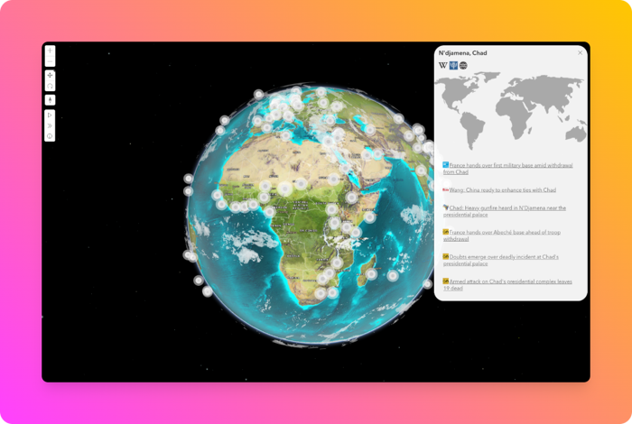

# 🌎 Planet News
This is a small experiment to visualize the current news (from open news sites without paywalls) on a rotating globe.

Visit the app here: 🌎 [Planet news](https://news.ianua.app).

The news is refreshed every 6 hours.

If you have an idea or suggestion for the app, then create an issue here in the repo, or reach out directly at 🫱 [ianua.app](https://ianua.app).

## Attributions
- [ArcGIS Maps SDK for JavaScript](https://developers.arcgis.com/javascript/latest/)

